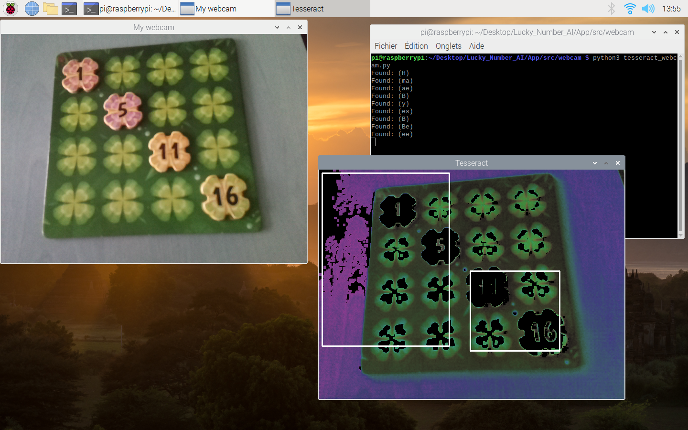
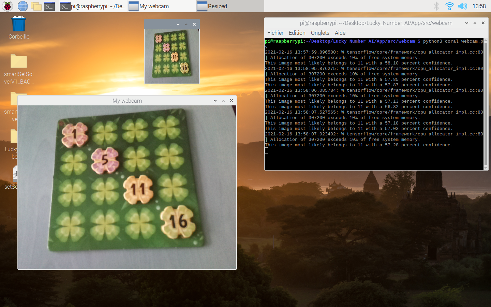

# Lucky_Number_AI
[Lucky Numbers](https://boardgamegeek.com/boardgame/118247/lucky-numbers) app using an AI.  
Developped during our fifth year of engineering classes at *ENSIM* school in Le Mans, France.  
Made by Gallien FRESNAIS, Zineb KABBAB, Lilian VALLEE

## Pre-requisites
- A webcam to try the OCR and AI (Token Recognition)
- Google Coral and Intel NCS2 (check the corresponding documentations for installation instructions)
- [tesseract](https://github.com/tesseract-ocr/tesseract/releases/latest)
- [tessdata](https://github.com/tesseract-ocr/tessdata/releases/latest) (additional data for tesseract)
- [Python 3.8](https://wiki.python.org/moin/BeginnersGuide/Download)
- The following Python libraries
    - [python-opencv](https://pypi.org/project/opencv-python/)
    - [numpy](https://numpy.org/install/)
    - [Flask](https://flask.palletsprojects.com/en/1.1.x/)
    - [threading](https://docs.python.org/3/library/threading.html)
    - [Jupyter Notebook](https://jupyter.org/install)
    - [pytesseract](https://pypi.org/project/pytesseract/)
    - [easyOCR](https://pypi.org/project/easyocr/) (to test the associated Jupyter Notebook)
    - [Tensorflow](https://www.tensorflow.org/install)

*You can also use an IDE such as [Pycharm Community](https://www.jetbrains.com/help/pycharm/installation-guide.html)*

## How to use
### Jupyter Notebooks
- You can launch **OCR_tesseract.ipynb** with Jupyter Notebook to learn how OCR with Tesseract works
- You can launch **OCR_easyOCR.ipynb** with Jupyter Notebook to learn how OCR with easyOCR works

### OCR and AI (Token Recognition)
- **App/src/webcam/tesseract_webcam.py** to use Tesseract
- **App/src/webcam/easyocr_webcam.py** to use easyOCR (buggy on the Raspberry Pi 4)
- **App/src/webcam/AI_webcam.py** to use the AI
- **App/src/webcam/coral_webcam.py** to use the AI with the Google Coral
- **App/src/webcam/ncs2_webcam.py** to use the AI with the Intel NCS2 (not implemented)

### Lucky Numbers AI (the game itself)
- You can launch **App/src/Application.py** to use the main program with a GUI (not yet playable)
- To train the AI, check **App/src/JoueurIA.py**

## Screenshots

> Tesseract on the Raspberry Pi 4

> AI Token Recognition with Google Coral

## License
Released under the [MIT license](LICENSE)